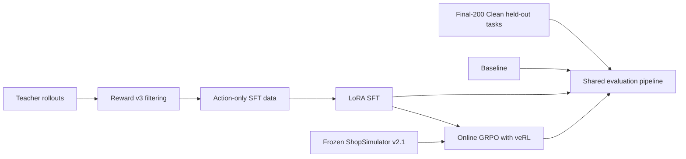
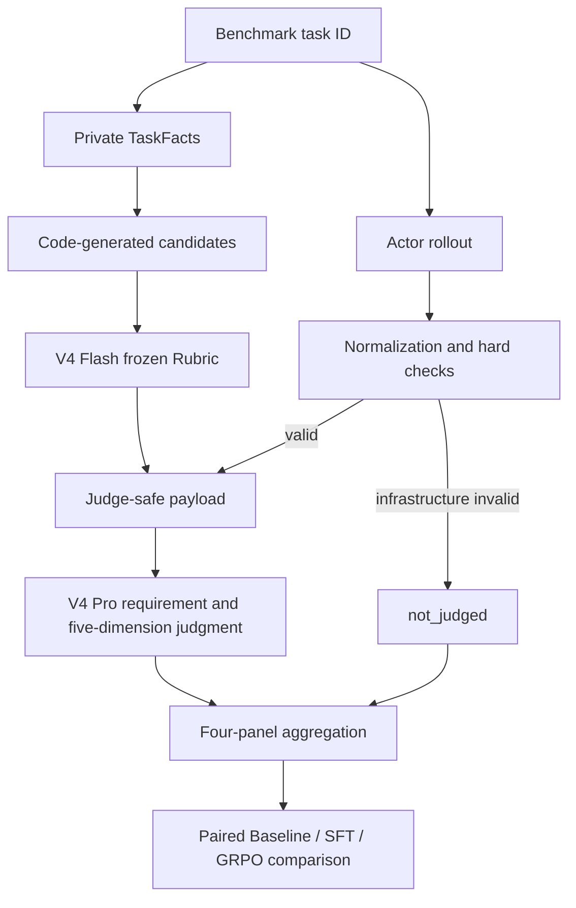

# Shopping GRPO

<div align="center">

**English** · [简体中文](README.md)

<br />

Reproducible post-training and evaluation for long-horizon shopping agents

<br />

[](pyproject.toml)
[](docs/sft.md)
[](https://github.com/verl-project/verl)
[](https://arxiv.org/pdf/2601.18225)
[](docs/evaluation-dataset.md)

<br />

Teacher rollouts and LoRA SFT → online GRPO with veRL → auditable comparison on
a frozen benchmark

</div>


## What is ShopSimulator?

[ShopSimulator](https://arxiv.org/pdf/2601.18225) is a large-scale Chinese
shopping environment for evaluating long-horizon LLM agents. A task describes
what a user wants—including category, budget, brand, model, functions and
product options—but the agent must discover the right item through interaction.

In this project the agent can search products, open candidates, inspect details,
select variants, buy, or stop when no acceptable item can be verified. Success
therefore requires more than producing a plausible answer: the agent must gather
evidence, obey constraints, choose the correct variant and terminate correctly.

The frozen Environment v2.1 source and product archive are embedded under
[`environments/ShopSimulator/`](environments/ShopSimulator/), so the tutorial
does not depend on a separately running third-party repository.


## The four stages

| Stage | What happens | Entry point | Details |
|---|---|---|---|
| Baseline | Evaluate the untouched base model | `bash scripts/baseline.sh` | [Evaluation](docs/evaluation.md) |
| SFT | Learn tool use from accepted teacher trajectories | `bash scripts/sft.sh` | [SFT](docs/sft.md) |
| GRPO | Optimize terminal Reward v3 with online rollouts | `bash scripts/grpo.sh` | [GRPO](docs/grpo.md) |
| Evaluation | Run the curated Final-200 Clean protocol | `bash scripts/evaluate.sh NAME` | [Evaluation](docs/evaluation.md) |

The checked-in SFT data was produced by a separate collection stage documented
in [Data collection](docs/data-collection.md). The custom constraint-aware
reward is specified in [Reward v3](docs/reward-v3.md).



### How the SFT data was collected

The current collection used `deepseek-v4-flash` as a teacher in ShopSimulator
Environment v2.1. It produced 2,498 raw trajectories, of which 1,026 passed the
strict acceptance filter. This frozen revision uses 1,000 trajectories split
into 800 training and 200 validation rows. SFT, GRPO and Final-200 Clean task IDs are
pairwise disjoint. Dataset hashes and the audit are in
[Data collection](docs/data-collection.md).

The resumable collection entry point is:

```bash
python scripts/collect_sft_data.py \
  --tasks data/grpo/train.jsonl \
  --output-dir outputs/sft-collection \
  --target-accepted 1000 \
  --workers 4
```

### How GRPO is trained

GRPO starts from the merged SFT model. veRL generates four online trajectories
per prompt in ShopSimulator, while deterministic Reward v3 scores the terminal
purchase, constraint satisfaction and termination behavior. No additional
LLM-as-a-Judge reward model is used for training.

The repository pins `verl==0.8.0` instead of copying its source. It keeps only
the project-specific AgentLoop, tool adapter, runtime compatibility code and a
small SHA-256-checked patch. See the [GRPO guide](docs/grpo.md) for details.

### How evaluation works

Formal evaluation combines deterministic checks with two LLM-as-Judge roles.
DeepSeek V4 Flash curates a frozen requirement Rubric from code-generated
category, brand, model, function, option and price candidates. It may select and
deduplicate candidates, but cannot invent fields or expected values. The same
Rubric is shared by Baseline, SFT and GRPO.

After each Actor completes a rollout, code normalizes events and computes
Reward, legality, repetition, context and infrastructure checks. Valid
trajectories then go to DeepSeek V4 Pro with the original Query, frozen Rubric,
Actor-visible trajectory, neutral terminal flags and allowlisted behavioral
metrics. Reward values, hidden Gold fields, raw observations, success labels and
other models' results are excluded.



V4 Pro scores Search Strategy, Candidate Utilization, Evidence Verification,
Decision Quality and Termination Efficiency independently on a 0/1/2 scale. It
also assesses each Rubric and assigns errors from a frozen taxonomy. The final
report keeps Reward/terminal, requirement Rubric, trajectory quality and
deterministic behavior as four separate panels—there is no composite score.
Failed, missing and not-judged tasks remain in the Final-200 Clean denominator. The
[evaluation guide](docs/evaluation.md) contains the complete prompts, one
worked benchmark example, input-isolation rules and aggregation contract. An
historical static view is available in the [Final-200 Benchmark Dashboard](docs/evaluation-dashboard.html); the current task set is documented in [Final-200 Clean](docs/evaluation-dataset.md).

> **Reserved figure — Training and evaluation pipeline.** A full-width diagram
> showing teacher data collection, LoRA SFT, online GRPO rollouts and the shared
> held-out evaluation path, with artifacts produced at each boundary.

## Results

A contributor reproduction is now available on the current Final-200 Clean
benchmark. See the [evaluation update log](docs/evaluation-updates.md) for the
full protocol, failure distribution and artifact hashes:

| Model | Strict success | Purchase success | Done rate | Mean reward |
|---|---:|---:|---:|---:|
| Qwen3.8-27B (BF16 weights, thinking disabled) | 73.0% | 73.0% | 99.5% | 0.6354 |

The following are archived Final-200 results; new comparisons use Final-200 Clean:

| Model | Strict success | Purchase success | Mean reward |
|---|---:|---:|---:|
| Qwen3.5-2B baseline | 0.0% | 0.0% | -0.1105 |
| LoRA SFT | 60.5% | 60.5% | 0.4729 |
| GRPO step 100 | 62.0% | 62.5% | 0.5158 |

The complete compact summaries and reproduction settings are in
[`experiments/`](experiments/). These are reported results, not a promise that
different hardware or dependency versions will produce bit-identical training.

## Training hardware and time

All training used a single NVIDIA RTX 6000 with 96 GB of GPU memory.

### LoRA SFT training (448 training examples, 3 epochs)

| Stage | Time | Peak GPU memory |
|---|---:|---:|
| One epoch (56 steps) | ~62 min | 89 GiB |
| Full 3-epoch training | ~3 h | 89 GiB |

### GRPO training (veRL 0.8, 8 environment workers)

| Step range | Per-step time | Cumulative time |
|---|---:|---:|
| steps 0–24 | ~140 s/step, including Ray startup | ~56 min |
| stable steps 20–30 | ~73–120 s/step | ~2 min/step in the steady state |
| 100 steps (reported checkpoint) | ~110 s/step on average | ~3–4 h |
| Full 500 steps | ~100 s/step | ~14 h |

### Other stages

| Stage | Estimated time |
|---|---:|
| Teacher collection (2,498 raw trajectories) | Depends on endpoint concurrency and rate limits |
| Final-200 Clean evaluation (Base) | ~20 min |
| Final-200 Clean evaluation (SFT/GRPO) | ~40–60 min |
| LLM Judge scoring for 200 trajectories | ~30–60 min |

## Requirements

- Linux with an NVIDIA GPU and a compatible CUDA driver;
- [`uv`](https://docs.astral.sh/uv/);
- about 25 GB of free disk for environments, weights and generated artifacts;
- approximately 48 GB GPU memory for the provided SFT recipe;
- one 96 GB GPU for the provided GRPO recipe.

The main environment uses Python 3.12. ShopSimulator is isolated on Python 3.10.
`uv` creates both environments. veRL is **installed as the pinned
`verl==0.8.0` dependency**; its source is not copied into this repository. Only
the Shopping Agent adapter and a small version-checked patch live here.

## Quick start

Run every command from the repository root.

### 1. Install

```bash
bash scripts/setup.sh
```

This installs the pinned SFT and GRPO dependencies, creates the isolated
ShopSimulator environment, verifies and expands the product archive, builds the
search index and applies the version-checked veRL patch.

### 2. Start ShopSimulator

Keep this terminal running:

```bash
bash scripts/start_environment.sh
```

The service listens on `http://127.0.0.1:5700`.

### 3. Evaluate the baseline

Start the base model server in a second terminal:

```bash
bash scripts/serve_model.sh Qwen/Qwen3.5-2B
```

Evaluate it in a third terminal:

```bash
bash scripts/baseline.sh
```

Stop the model server before training so it releases the GPU.

### 4. Train and evaluate SFT

```bash
bash scripts/sft.sh
bash scripts/serve_model.sh outputs/models/sft-merged
bash scripts/evaluate.sh sft
```

Stop the model server again before GRPO.

### 5. Train GRPO

First inspect the fully resolved launcher without starting CUDA or Ray:

```bash
bash scripts/grpo.sh --dry-run
```

Then train:

```bash
bash scripts/grpo.sh
```

Choose a checkpoint using validation metrics and export its actor:

```bash
bash scripts/export_grpo.sh \
  outputs/models/grpo/global_step_100/actor \
  outputs/models/grpo-merged
```

Evaluate it:

```bash
bash scripts/serve_model.sh outputs/models/grpo-merged
bash scripts/evaluate.sh grpo
```

Generated checkpoints, rollouts and logs are written under `outputs/`, which is
ignored by Git.

## Reward V3 overview

Reward v3 is a deterministic terminal reward; it does not rely on another
language model for subjective judgment:

- category and budget are hard gates;
- brand, model, core functions and key options use weights of
  `0.35 / 0.25 / 0.25 / 0.15`;
- an exact target purchase with full satisfaction receives `1.0`;
- a fully satisfying alternative item receives `0.55`;
- partial satisfaction receives a continuous score capped at `0.25`;
- wrong purchases, premature abstention, repeat loops and maximum-step
  termination receive distinct negative rewards;
- insufficient evidence sets `reward_valid=false`, rather than being treated as
  a valid neutral zero.


The complete formula, termination rules and evidence requirements are in the
[Reward v3 design guide](docs/reward-v3.md).

## Repository map

```text
configs/                         current GRPO, AgentLoop and tool configuration
data/
  sft/                           800 train + 200 validation trajectories
  grpo/                          ready-to-train JSONL and veRL Parquet
  evaluation/                    curated Final-200 Clean held-out set
docs/                            one guide for each tutorial stage and Reward v3
environments/ShopSimulator/      embedded environment and product archive
experiments/
  baseline/                      baseline config and result summary
  sft/                           SFT config and result summary
  grpo/                          GRPO config and result summary
scripts/                         thin user-facing tutorial entry points
src/shopping_grpo/
  collection/                    Teacher acceptance and SFT data construction
  environment/                   HTTP client, tools, actions and observations
  training/sft/                  SFT dataset masking and collation
  training/grpo/                 veRL adapter, compatibility and sampling logic
  evaluation/                    hard checks, Rubrics, trajectory Judge and metrics
tests/                           focused unit, launcher and packaging checks
```

The project keeps focused checks for the CPU smoke path, offline trajectory
evaluation, GRPO launcher arguments, non-editable wheel installation, Reward
aggregation and the frozen environment manifest. Cleanup does not mean deleting
tests that protect the public workflow.

## Configuration

Most users only need these environment variables:

| Variable | Default |
|---|---|
| `BASE_MODEL` | `Qwen/Qwen3.5-2B` |
| `SHOPSIM_BASE_URL` | `http://127.0.0.1:5700` |
| `LLM_BASE_URL` | `http://127.0.0.1:8000/v1` |
| `SERVED_MODEL_NAME` | `shopping-agent` |
| `SFT_ADAPTER_DIR` | `outputs/models/sft-lora` |
| `SFT_MERGED_DIR` | `outputs/models/sft-merged` |

Advanced GRPO overrides can be appended after `--`:

```bash
bash scripts/grpo.sh -- \
  trainer.total_training_steps=20 \
  trainer.save_freq=10
```

SwanLab logging is opt-in:

```bash
export SWANLAB_API_KEY=...
bash scripts/grpo.sh --logger swanlab
```

## Documentation

- [Data collection and dataset provenance](docs/data-collection.md)
- [LoRA SFT](docs/sft.md)
- [GRPO with veRL](docs/grpo.md)
- [Held-out evaluation](docs/evaluation.md)
- [Final-200 Clean evaluation dataset](docs/evaluation-dataset.md)
- [Final-200 Benchmark Dashboard (historical)](docs/evaluation-dashboard.html)
- [Reward v3 design](docs/reward-v3.md)
- [Auditable experiment results](experiments/comparison.md)

## References and acknowledgements

This tutorial builds on the
[ShopSimulator paper](https://arxiv.org/pdf/2601.18225) and source project,
[veRL](https://github.com/verl-project/verl), and
[Qwen](https://github.com/QwenLM/Qwen3).

The evaluation protocol and Benchmark construction were also informed by
[VitaBench: Benchmarking LLM Agents with Versatile Interactive Tasks in Real-world Applications](https://arxiv.org/pdf/2509.26490)
and
[EComAgentBench: Benchmarking Shopping Agents on Long-Horizon Tasks with Distributed Hidden Intent](https://arxiv.org/pdf/2606.17698).

The repository organization and tutorial presentation were informed by
[qiqihezh/agentic-grpo-longhorizon](https://github.com/qiqihezh/agentic-grpo-longhorizon).
Thanks to the [OpenCode Go plan](https://dev.opencode.ai/go) for supporting the
development workflow.

### Contributors

<a href="https://github.com/Guochangwei917">
  
</a>
