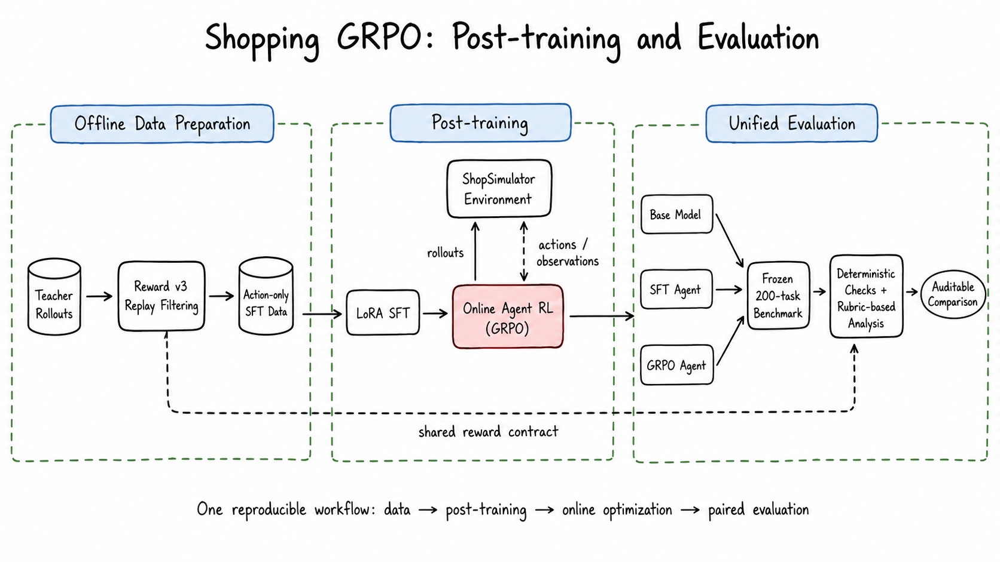
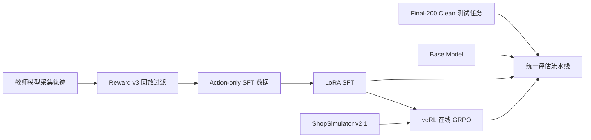
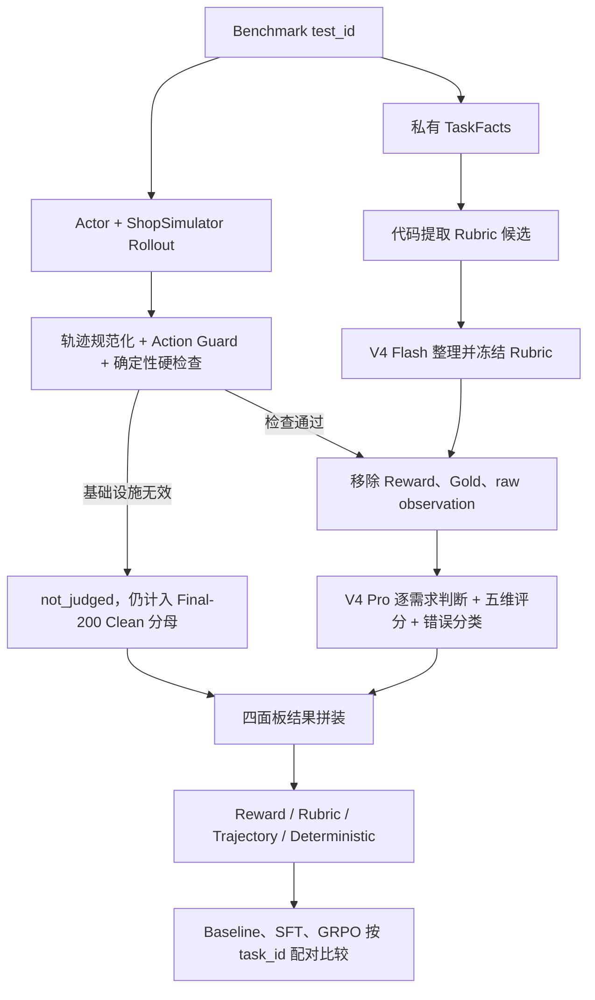

# Shopping GRPO

<div align="center">

**简体中文** · [English](README.en.md)

<br />

面向长程购物 Agent 的可复现后训练与评测项目

<br />

[](pyproject.toml)
[](docs/sft.md)
[](https://github.com/verl-project/verl)
[](https://arxiv.org/pdf/2601.18225)
[](docs/evaluation-dataset.md)

<br />

教师轨迹与 LoRA SFT → veRL 在线 GRPO → Final-200 Clean Benchmark 的可审计对比

</div>



## ShopSimulator 是什么？

[ShopSimulator](https://arxiv.org/pdf/2601.18225) 是一个用于评估长程购物
Agent 的大规模中文购物环境。每个任务会给出一段用户需求，其中可能包含商品类别、
预算、品牌、型号、核心功能以及颜色、尺寸、容量、套餐等具体规格。

Agent 不能只生成一句“推荐购买某商品”，而是必须真正与环境交互：

1. 根据需求搜索商品；
2. 打开并比较候选商品；
3. 查看描述、参数和可选规格；
4. 选择正确的商品变体；
5. 购买满足约束的商品，或者在证据充分时合理终止。

这类任务同时考察指令理解、工具调用、长上下文管理、约束满足和终止决策。项目内嵌
了冻结的 ShopSimulator Environment v2.1 源码和商品数据，位于
[`environments/ShopSimulator/`](environments/ShopSimulator/)，不需要用户再单独
克隆或修改一份环境仓库。


## 项目做了什么？

项目按照一条连续的后训练流水线组织：



| 阶段 | 目标 | 入口 | 详细文档 |
|---|---|---|---|
| Baseline | 测量原始 Qwen3.5-2B 的工具使用能力 | `bash scripts/baseline.sh` | [评估](docs/evaluation.md) |
| SFT | 从高质量教师轨迹学习合法、完整的购物行为 | `bash scripts/sft.sh` | [SFT](docs/sft.md) |
| GRPO | 在真实环境 Rollout 中优化 Reward v3 | `bash scripts/grpo.sh` | [GRPO](docs/grpo.md) |
| Evaluation | 使用同一批 Final-200 Clean 留出任务公平比较模型 | `bash scripts/evaluate.sh NAME` | [评估](docs/evaluation.md) |

### SFT 数据是怎么收集的？

当前数据使用 `deepseek-v4-flash` 作为教师模型，在 ShopSimulator
Environment v2.1 中采集：

- 共获得 2,498 条原始任务轨迹；
- 每条轨迹在采集时都真实执行环境动作，再按 Reward v3 终局结果验收；
- 其中 1,026 条通过严格验收，本次固定使用 1,000 条；
- 最终划分为 800 条训练数据和 200 条验证数据，并与 GRPO、Final-200 Clean
  保持 task_id 零重叠。

仓库已提供可断点续跑的采集入口：

```bash
python scripts/collect_sft_data.py \
  --tasks data/grpo/train.jsonl \
  --output-dir outputs/sft-collection \
  --target-accepted 1000 \
  --workers 4
```

SFT 只在 Assistant 动作 token 上计算 Loss，用户指令和环境 Observation 会被
Mask。这样模型学习的是可执行的工具策略，而不是背诵环境返回内容。数据哈希、接受率
和采集审计见[数据采集文档](docs/data-collection.md)。

### GRPO 是怎么训练的？

GRPO 从合并后的 SFT 模型开始。veRL 在 ShopSimulator 中为每个 Prompt 在线生成
四条轨迹，环境用确定性的 Reward v3 评估最终购买结果、约束满足程度和终止行为。
训练不使用额外的 LLM-as-a-Judge Reward Model。

本仓库没有复制 veRL 源码，而是固定安装 `verl==0.8.0`，并保留项目自己的
AgentLoop、工具适配层、运行时兼容代码和一个带 SHA-256 校验的小补丁。详细配置见
[GRPO 文档](docs/grpo.md)。

### 评估流水线是怎么设计的？

正式评估由“代码硬检查 + 两个 LLM-as-Judge + 固定分母聚合”组成。两个 Judge
职责不同：

- **DeepSeek V4 Flash 是 Rubric Curator。** 代码先根据每道题的 Query 和私有
  TaskFacts 提取品类、品牌、型号、功能、规格和价格候选；Flash 只能从候选中选择
  用户真正要求的约束、去重并标注 hard/soft，不能创造新的字段或期望值。生成的
  Rubric 冻结一次，由 Baseline、SFT 和 GRPO 共用。
- **DeepSeek V4 Pro 是 Trajectory Judge。** 它读取用户 Query、冻结 Rubric、
  Actor 实际看到的完整轨迹、中性终局状态和白名单代码指标，逐条判断需求是否满足，
  并从搜索策略、候选利用、证据核验、决策质量、终止效率五个维度分别打 0/1/2 分。

这里的 Rubric 是逐任务评分标准，不是向量检索式 RAG。



以 Final-200 中的 `task_id=8187` 为例，Query 要求“一对卡通-永结同心款的高档
酒红色木梳、礼盒、陪嫁、20 元左右”。代码生成 7 条候选，V4 Flash 冻结为 5 条
Rubric；SFT Actor 用 10 步完成搜索、详情核验、规格选择和购买；V4 Pro 最终给出
`搜索策略 2 / 候选利用 1 / 证据核验 1 / 决策质量 2 / 终止效率 2`，并为每项判断
引用真实的 `event_id`。

Pro 看不到 Reward 分数、Gold 商品私有字段、raw Observation、成功标签或其他模型
结果，因此不能根据答案倒推轨迹质量。最终结果分为四个独立面板：

1. Environment Reward 与终局；
2. Query Rubric 的 hard/soft 满足情况和 Reward disagreement；
3. Pro Judge 五维分布与错误类型；
4. 步数、工具、Guard、重复、上下文和基础设施指标。

四部分不会合成一个总分。缺失、报错和 `not_judged` 任务仍保留在 Final-200 Clean 分母中。
完整数据流、两个模型的完整 Prompt、输入隔离规则、示例 Rubric 和最终统计口径见
[评估流水线文档](docs/evaluation.md)。当前集的筛选依据见
[Final-200 Clean 说明](docs/evaluation-dataset.md)；[Final-200 Dashboard（历史）](docs/evaluation-dashboard.html)
只保留为历史归档。


## 实验结果

当前 Final-200 Clean 上新增了一次贡献者复现实验；完整协议、失败分布和产物哈希见
[评测更新记录](docs/evaluation-updates.md)：

| 模型 | 严格成功率 | 购买成功率 | 完成终局率 | 平均 Reward |
|---|---:|---:|---:|---:|
| Qwen3.8-27B（BF16 权重，关闭思考） | 73.0% | 73.0% | 99.5% | 0.6354 |

以下是历史 Final-200 的归档结果；当前横向比较统一使用 Final-200 Clean：

| 模型 | 严格成功率 | 购买成功率 | 平均 Reward |
|---|---:|---:|---:|
| Qwen3.5-2B Baseline | 0.0% | 0.0% | -0.1105 |
| LoRA SFT | 60.5% | 60.5% | 0.4729 |
| GRPO step 100 | 62.0% | 62.5% | 0.5158 |

SFT 带来了主要能力提升，让模型学会合法工具调用、长程搜索和正确终止；GRPO 在此
基础上进一步减少错误购买、循环和非法动作。机器可读的训练配置、结果摘要和限制说明
位于 [`experiments/`](experiments/)。

## 训练硬件与耗时

所有训练均使用单张 NVIDIA RTX 6000（96 GB）完成。

### SFT LoRA 训练（448 条训练数据，3 个 epoch）

| 阶段 | 耗时 | 峰值显存 |
|---|---:|---:|
| 单个 epoch（56 步） | ~62 分钟 | 89 GiB |
| 完整 3 个 epoch | ~3 小时 | 89 GiB |

### GRPO 训练（veRL 0.8，8 个环境 worker）

| 步数范围 | 单步耗时 | 累计耗时 |
|---|---:|---:|
| step 0–24 | ~140 秒/步（含 Ray 启动开销） | ~56 分钟 |
| step 20–30 稳定后 | ~73–120 秒/步 | ~2 分钟/步稳定态 |
| 100 步（报告 checkpoint） | ~110 秒/步均值 | ~3–4 小时 |
| 完整 500 步 | ~100 秒/步 | ~14 小时 |

### 其他环节

| 环节 | 耗时估算 |
|---|---:|
| Teacher 采集（2,498 条原始轨迹） | 取决于接口并发与限流 |
| 200 任务评测（Base） | ~20 分钟 |
| 200 任务评测（SFT/GRPO） | ~40–60 分钟 |
| LLM Judge 评分 200 条轨迹 | ~30–60 分钟 |

## 环境要求

- Linux；
- NVIDIA GPU 和兼容的 CUDA Driver；
- [`uv`](https://docs.astral.sh/uv/)；
- 大约 25 GB 可用磁盘空间，用于依赖、模型权重和运行产物；
- SFT 配置按照 48 GB 显存设计；
- GRPO 配置按照单张 96 GB GPU 验证。

主训练环境使用 Python 3.12，ShopSimulator 使用隔离的 Python 3.10 环境。
`scripts/setup.sh` 会通过 `uv` 创建并安装两套环境。

## 快速开始

以下命令都在仓库根目录执行。

### 1. 安装

```bash
bash scripts/setup.sh
```

该脚本会安装固定版本的 SFT、veRL 和 vLLM 依赖，创建独立的 ShopSimulator
环境，校验并解压商品数据，构建搜索索引，并应用经过版本和哈希检查的 veRL 补丁。

### 2. 启动 ShopSimulator

在第一个终端运行并保持服务：

```bash
bash scripts/start_environment.sh
```

服务默认监听 `http://127.0.0.1:5700`。

### 3. 运行 Baseline

在第二个终端启动基础模型：

```bash
bash scripts/serve_model.sh Qwen/Qwen3.5-2B
```

在第三个终端评估：

```bash
bash scripts/baseline.sh
```

开始训练前请停止模型服务，释放 GPU 显存。

### 4. 训练并评估 SFT

```bash
bash scripts/sft.sh
bash scripts/serve_model.sh outputs/models/sft-merged
bash scripts/evaluate.sh sft
```

完成评估后再次停止模型服务。

### 5. 训练 GRPO

先只解析并打印最终命令，不启动 CUDA 或 Ray：

```bash
bash scripts/grpo.sh --dry-run
```

开始训练：

```bash
bash scripts/grpo.sh
```

根据验证集指标选择 Checkpoint，并导出 veRL Actor：

```bash
bash scripts/export_grpo.sh \
  outputs/models/grpo/global_step_100/actor \
  outputs/models/grpo-merged
```

启动并评估导出的模型：

```bash
bash scripts/serve_model.sh outputs/models/grpo-merged
bash scripts/evaluate.sh grpo
```

每次 `evaluate.sh` 完成后会自动生成 `outputs/evaluation/grpo/report.html`。对已有评测结果补生成报告：

```bash
bash scripts/report.sh grpo
```

批量生成所有单模型报告和综合比较报告：

```bash
bash scripts/report_all.sh
```

报告生成器按评测目录读取 `summary.json` 和 `trajectories.jsonl`，模型名与评测参数会从结果中自动填入，因此换模型或换评测标签不需要修改报告代码。

Checkpoint、Rollout 和日志统一写入 Git 忽略的 `outputs/`。

## Reward v3 简介

Reward v3 是一个确定性的终局 Reward，不依赖另一个大模型进行主观判断：

- 类别和预算是 Hard Gate；
- 品牌、型号、核心功能、关键规格按照 `0.35 / 0.25 / 0.25 / 0.15` 加权；
- 完全满足并命中目标商品得到 `1.0`；
- 完全满足的替代商品得到 `0.55`；
- 部分满足按照连续分数计算，最高 `0.25`；
- 错误购买、过早放弃、重复循环和达到最大步数都会获得不同负奖励；
- 证据不足时标记为 `reward_valid=false`，不会伪装成有效的零分样本。


完整公式、终止条件和证据要求见 [Reward v3 设计文档](docs/reward-v3.md)。

## 仓库结构

```text
configs/                         当前 GRPO、AgentLoop 和工具配置
data/
  sft/                           800 条训练 + 200 条验证轨迹
  grpo/                          JSONL 与 veRL Parquet 数据
  evaluation/                    Final-200 Clean 留出任务
docs/                            数据、SFT、GRPO、评估与 Reward 文档
environments/ShopSimulator/      内嵌环境源码和商品数据
experiments/
  baseline/                      Baseline 配置与结果
  sft/                           SFT 配置与结果
  grpo/                          GRPO 配置与结果
scripts/                         面向用户的薄入口脚本
src/shopping_grpo/
  collection/                    Teacher 轨迹验收与 SFT 数据构造
  environment/                   环境客户端、动作、工具和 Observation
  training/sft/                  SFT 数据渲染与 Mask
  training/grpo/                 veRL AgentLoop、适配和动态采样
  evaluation/                    硬检查、Rubric、轨迹 Judge 和指标汇总
tests/                           核心单元、入口和 Wheel 安装检查
```

## 常用配置

| 环境变量 | 默认值 |
|---|---|
| `BASE_MODEL` | `Qwen/Qwen3.5-2B` |
| `SHOPSIM_BASE_URL` | `http://127.0.0.1:5700` |
| `LLM_BASE_URL` | `http://127.0.0.1:8000/v1` |
| `SERVED_MODEL_NAME` | `shopping-agent` |
| `SFT_ADAPTER_DIR` | `outputs/models/sft-lora` |
| `SFT_MERGED_DIR` | `outputs/models/sft-merged` |

GRPO 的高级 Hydra 参数可以追加在 `--` 后：

```bash
bash scripts/grpo.sh -- \
  trainer.total_training_steps=20 \
  trainer.save_freq=10
```

SwanLab 默认关闭，需要时显式启用：

```bash
export SWANLAB_API_KEY=...
bash scripts/grpo.sh --logger swanlab
```

## 文档导航

- [数据采集与数据来源](docs/data-collection.md)
- [LoRA SFT](docs/sft.md)
- [使用 veRL 进行 GRPO](docs/grpo.md)
- [留出集评估](docs/evaluation.md)
- [Final-200 Clean 测试集说明](docs/evaluation-dataset.md)
- [Final-200 Benchmark Dashboard（历史）](docs/evaluation-dashboard.html)
- [Reward v3 设计](docs/reward-v3.md)
- [可审计实验结果](experiments/comparison.md)

## Star History

<a href="https://www.star-history.com/?repos=YYHDBL%2Fshopping-grpo-longhorizon&type=date&legend=top-left">
 <picture>
   <source media="(prefers-color-scheme: dark)" srcset="https://api.star-history.com/chart?repos=YYHDBL/shopping-grpo-longhorizon&type=date&theme=dark&legend=top-left&sealed_token=wgQ1K2TiIB2luvZFJ54oMEhME-cxYmFv_wNoNXnT7lMZHsuQUy7NThQAG2VwpEeiUBoRxd09ASiB60cvvBaEvqVqyv49wYKZSF2H_Jft3Iq1ZZ0c5Sk2SQQejxHxMQwayMTRroOh5JhcWgXk6w8HHwjP6UgTquINRr40c7XysMi_j2BksVwqOWSIz8Ny" />
   <source media="(prefers-color-scheme: light)" srcset="https://api.star-history.com/chart?repos=YYHDBL/shopping-grpo-longhorizon&type=date&legend=top-left&sealed_token=wgQ1K2TiIB2luvZFJ54oMEhME-cxYmFv_wNoNXnT7lMZHsuQUy7NThQAG2VwpEeiUBoRxd09ASiB60cvvBaEvqVqyv49wYKZSF2H_Jft3Iq1ZZ0c5Sk2SQQejxHxMQwayMTRroOh5JhcWgXk6w8HHwjP6UgTquINRr40c7XysMi_j2BksVwqOWSIz8Ny" />
   
 </picture>
</a>

## 引用与致谢

本项目建立在
[ShopSimulator 论文](https://arxiv.org/pdf/2601.18225)及其开源环境、
[veRL](https://github.com/verl-project/verl) 和
[Qwen](https://github.com/QwenLM/Qwen3) 之上。

评测协议和 Benchmark 构建还参考了
[VitaBench: Benchmarking LLM Agents with Versatile Interactive Tasks in Real-world Applications](https://arxiv.org/pdf/2509.26490)
以及
[EComAgentBench: Benchmarking Shopping Agents on Long-Horizon Tasks with Distributed Hidden Intent](https://arxiv.org/pdf/2606.17698)。

仓库结构和教程呈现参考了
[qiqihezh/agentic-grpo-longhorizon](https://github.com/qiqihezh/agentic-grpo-longhorizon)。
感谢 [OpenCode Go 套餐](https://dev.opencode.ai/go) 对开发工作的支持。

### Contributors

<a href="https://github.com/Guochangwei917">
  
</a>
