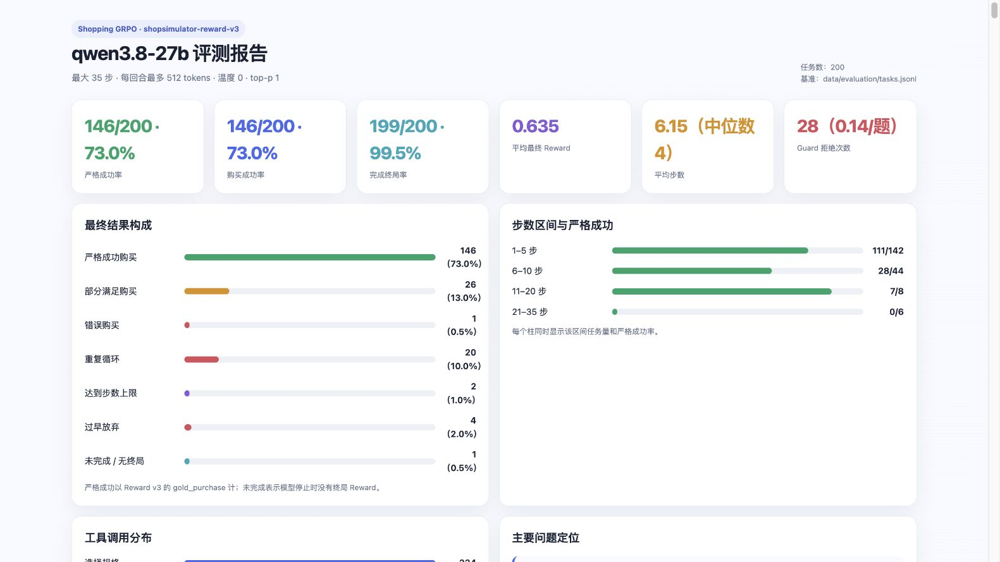

# 评测集更新与轨迹审计记录

本文件是评测资产的追加式记录。每次更新都应记录日期、任务数和哈希、变更 task ID、
证据、对历史结果的影响，以及是否重新运行了 rollout。完整原始轨迹是本地
`outputs/evaluation/` 产物，不提交到 Git；这里保存可复核的汇总和 bad-case 结论。

## 2026-08-16 — Qwen3.8-27B Final-200 Clean 贡献者评测

本次新增的是模型评测结果，不改变 Final-200 Clean 任务、Environment 或 Reward 契约。

### 冻结协议

- 模型：`Qwen3.8-27B`，BF16 权重，4 卡 tensor parallel，FP8 KV cache；
- 推理：通过 `chat_template_kwargs.enable_thinking=false` 关闭思考；
- 提示词：作者原始 system prompt，不追加示例；
- 采样：`temperature=0`、`top_p=1`、每题 1 条 rollout；
- 限制：最多 35 步，每回合最多 512 tokens，上下文 24576 tokens，不压缩历史；
- Runtime：Environment v2.1 / Reward v3 / observation v2 / tools v2；
- Observation budgets：1536 / 4096 / 768 tokens，搜索结果 top-k 20。

### 结果

| 指标 | 结果 |
|---|---:|
| 严格成功 / `gold_purchase` | 146/200（73.0%） |
| 购买成功 | 146/200（73.0%） |
| 完成终局 | 199/200（99.5%） |
| 平均最终 Reward | 0.6354 |
| 平均加权得分 | 0.7797 |
| 平均 / 中位步数 | 6.15 / 4 |
| Guard 拒绝 | 28（0.14/题） |
| 端到端评测耗时 | 19 分 59 秒 |

终局分布为：146 题严格成功、26 题部分满足购买、20 题重复循环、4 题过早放弃、
2 题达到步数上限、1 题错误购买、1 题无终局。唯一无终局题为冻结 24576-token
窗口下的 `ContextBudgetError`，仍保留在 200 题分母中。

步数区间的严格成功分别为：1–5 步 `111/142`、6–10 步 `28/44`、11–20 步
`7/8`、21–35 步 `0/6`。



### 可复核性

- Final-200 Clean SHA-256：
  `d99112a20ef47534c27a32e4b38229bf048dcc6b06fef2e3e919aac3093662f5`；
- 200 条原始轨迹 SHA-256：
  `b6edf31214aa162599ac8c676ef80e869f496957dbf9627837bdaf93da59e9b5`；
- `summary.json` SHA-256：
  `d46e1745cc463a7a50d5669b1fd401dbbeeaebab366e958bfdacc96703b85333`。

原始轨迹继续按仓库约定保存在本地 `outputs/evaluation/`，不提交到 Git。本次同时修复
通用 HTML 报告中遗漏 `early_abstain` 以及把 Guard 百分比误标成“每题次数”的问题，并
增加回归测试。

## 2026-08-13 — Final-200 Clean 补齐并取代 Final-183

### 数据集变更

- 当前集：Final-200 Clean，200 题，SHA-256
  `d99112a20ef47534c27a32e4b38229bf048dcc6b06fef2e3e919aac3093662f5`。
- 从 Final-183 保留 119 题，移除 64 道遗留问题题，并补入 81 道新任务；相对原始
  Final-200，一共永久排除 81 个 source task ID，完整清单和补题 ID 见
  [Final-200 Clean 说明](evaluation-dataset.md)。
- 新发现：原始轨迹审计识别的 17 题之外，还有 60 题的 Query 明确提出价格、但 Reward v3
  没有解析预算；另有 3 题目标价超出已解析预算，1 题的 Query 和 gold 尺寸/花色相互矛盾。
- 补题方法：在冻结任务池中排除所有当前训练 task ID 后，按被替换题的硬约束数量分层、固定
  seed `20260813` 抽样。每道补题都通过目标 `gold_purchase`、规格可解析、variant 价格可解、
  已声明预算可解析且通过的静态核验。

### 对历史结果的影响

此前的 Final-183 分母重算仅可作为归档审计，不能转换成 Final-200 Clean 成绩；新 81 题从未
在那些 rollout 中运行。之后所有模型都应在 Final-200 Clean 上以相同运行时重新 rollout。

## 2026-08-13 — Final-183 取代 Final-200

### 数据集变更

- 原始集：Final-200，200 题，SHA-256 `2c4ff070e13ddc30796d38e85170210e7d3c211992425a62090f2419fe8e0208`。
- 当前集：Final-183，183 题，SHA-256 `0d723a9fcf95d026c79c83b833eec2cb85aa49013da5f661cd1cb581aede773a`。
- 剔除：17 题，完整 ID 与理由见 [Final-183 说明](evaluation-dataset.md)。
- 依据：6 题在当前 Reward v3 下严格成功不可达，7 题存在 Query-gold 冲突或隐藏的
  gold 约束，4 题因口语预算被错当成硬上限而使 gold 无解。

### 历史轨迹的分母重算

下表是对已经完成的 Final-200 轨迹按 Final-183 task ID 重算的结果，**不是新的
模型 rollout**。17 道剔除题在六个模型中均未获得严格 `gold_purchase`，所以分子不变，
分母从 200 改为 183。

| 模型 | Final-200 严格成功 | Final-183 重算 |
|---|---:|---:|
| Qwen3.7 Max | 149/200 (74.50%) | 149/183 (81.42%) |
| DeepSeek V4 Flash | 139/200 (69.50%) | 139/183 (75.96%) |
| GLM-5.2 | 125/200 (62.50%) | 125/183 (68.31%) |
| Qwen3.7 Flash | 124/200 (62.00%) | 124/183 (67.76%) |
| DeepSeek V4 Pro | 123/200 (61.50%) | 123/183 (67.21%) |
| Qwen3.7 Plus | 75/200 (37.50%) | 75/183 (40.98%) |

历史结果中 GLM-5.2 的上下文与 observation 投影设置不同于另外五个模型，因此其
排名只能作为参考；再次比较时应在 Final-183 上使用同一运行时协议。

### 已对齐的 bad case 结论

| 模型 | 最主要的失败方式 | 口语化解释 |
|---|---|---|
| Qwen3.7 Max | 过快购买、规格没落到最终状态 | 看见差不多的商品就下单，颜色、尺码或数量少核一步。 |
| DeepSeek V4 Flash | 重复搜索和反复比较 | 找到接近答案后还不放心，绕来绕去把步数耗完。 |
| GLM-5.2 | 最后一步没有调用工具 | 已经看到了商品、甚至核对了规格，却用文字停下，没有真的购买。 |
| Qwen3.7 Flash | 单候选购买、规格遗漏 | 通常只看一款，标题像就买，没把详情、价格和选项一起核对。 |
| DeepSeek V4 Pro | 页面状态跟丢 | 拿旧页面按钮继续点，触发非法动作限制。 |
| Qwen3.7 Plus | 循环与输出长度中断 | 不是乱买，而是太犹豫；不断换相近搜索词，最后被循环或长度限制打断。 |

跨模型的共同问题是：候选标题接近时不查详情或最终变体价；正确候选出现后没有及时
收口；以及没有把当前页面状态当作工具调用的唯一依据。较强模型的优势主要不是“找到
更多商品”，而是更早确认硬条件后能及时购买，并较少重复。

### 下次更新模板

```text
日期：
变更类型：新增评测 / 任务剔除 / 规则修复 / 仅文档
当前任务数与 SHA-256：
变更 task_id：
证据与判定：
是否重新 rollout：是 / 否（若否，说明重算方法）
模型结果变化：
新增或修正的 bad case：
```
